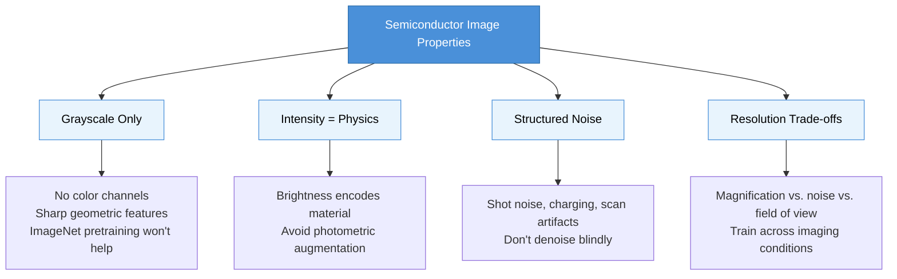
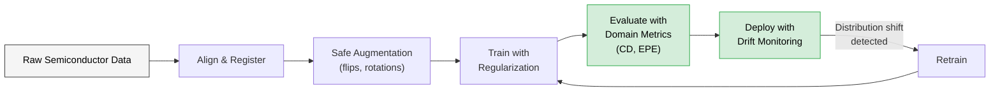
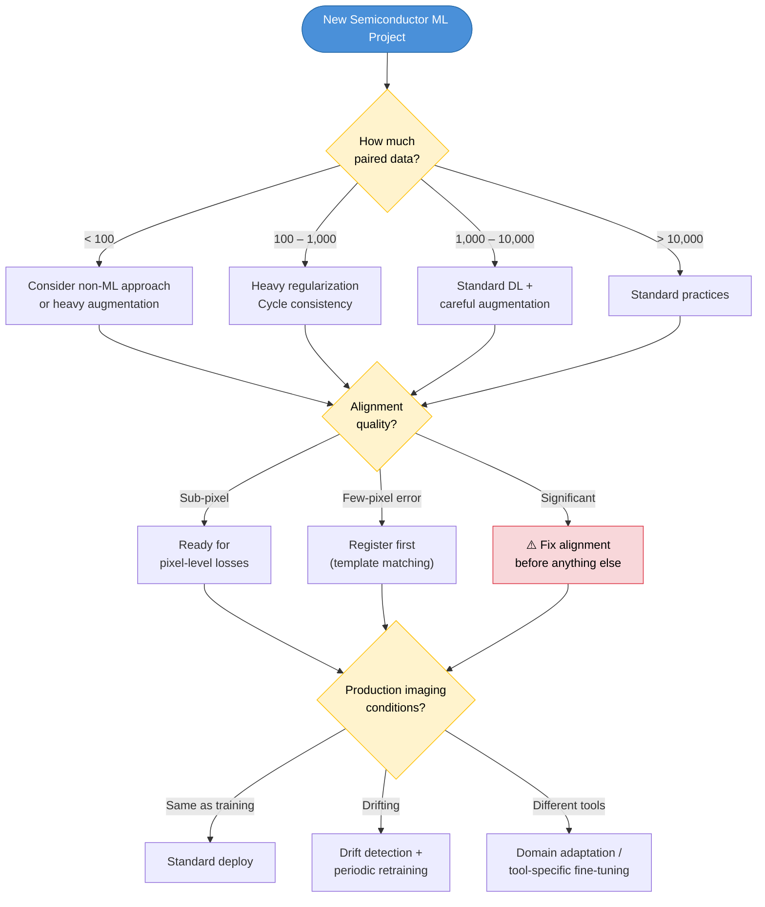

If you have worked on computer vision, you are probably used to abundance. ImageNet has 14 million images. COCO has 330,000. Even niche medical imaging benchmarks offer tens of thousands of labeled examples, often freely available for download.

Semiconductor manufacturing data exists in a different universe.

## The Dataset You Cannot Download

Every image in a semiconductor dataset is the end product of an extraordinarily expensive physical process. A single wafer passes through hundreds of processing steps — lithography, etching, deposition, chemical-mechanical polishing — each performed by multi-million dollar tools in a cleanroom that costs billions to build. The metrology images (SEM, optical, AFM) that capture the results are acquired on equally expensive inspection and measurement tools with limited throughput.

You do not get to "collect more data" by pointing a camera at the world. Every additional training sample costs real money and real fab time. Datasets of a few hundred to a few thousand paired images are typical. Ten thousand would be exceptional.

This scarcity is the single most important fact about semiconductor ML, and nearly every engineering decision flows from it.

---

## How Semiconductor Images Differ from Natural Images

If you are coming from a background in natural image processing — photographs, video, medical scans — semiconductor metrology data will surprise you in several ways.

### Grayscale, High-Contrast, Highly Structured

Natural images are rich in color, texture gradients, and organic shapes. Semiconductor images are almost always **single-channel grayscale**, with a narrow dynamic range dominated by sharp geometric features. A typical SEM field of view might contain nothing but parallel lines at 30nm pitch, or a grid of identical contact holes. The "interesting" information is in the edges — their position, roughness, and profile — not in broad texture or color.

This means architectures and augmentation strategies designed for RGB natural images often need rethinking. Color-based augmentations are meaningless. Pretrained ImageNet features, which have learned to detect fur, sky, and faces, offer limited transferable knowledge for detecting 5nm edge placement errors.

### Intensity Encodes Physics, Not Aesthetics

In a photograph, pixel brightness is a somewhat arbitrary function of exposure, white balance, and artistic intent. Adjusting brightness or contrast during augmentation is harmless because the semantic content is invariant to these transforms.

In an SEM image, **intensity directly encodes physical properties.** Bright regions may indicate material contrast (different secondary electron yield), topographic edges (increased emission at steep surfaces), or charging effects (insulating regions accumulating electrons). A region that appears brighter than expected could signal a real process defect — resist residue, incomplete etch, or material contamination.

This has a direct consequence for data pipelines: **photometric augmentation (brightness, contrast, gamma) should generally be avoided.** Artificially shifting intensity distributions creates training examples that do not correspond to any real physical scenario. The model may learn to be robust to intensity variations that never occur in practice, while failing on the subtle intensity differences that actually matter.

### Noise Has Structure and Meaning

Noise in a photograph is typically modeled as additive Gaussian — random, independent, and unrelated to the scene content. Standard denoising is safe because the noise carries no useful information.

SEM noise is fundamentally different:

- **Shot noise** from the Poisson statistics of electron emission varies with signal level — brighter regions are noisier. This is signal-dependent, not signal-independent.
- **Detector noise** from the electron detector electronics adds a baseline noise floor.
- **Charging artifacts** occur when insulating regions accumulate electrons, creating local brightness fluctuations that correlate with material properties and geometry.
- **Vibration and drift** during image acquisition create systematic spatial distortions, not random pixel noise.
- **Scan line artifacts** from the raster scanning of the electron beam can introduce line-to-line intensity variations.

Aggressive denoising before feeding images to a model risks destroying useful signal. The charging pattern on an insulating feature, for instance, contains information about the material and geometry that a well-trained model can learn to interpret. The practical approach is to let the model learn to see *through* the noise rather than removing the noise as a preprocessing step.

If denoising is necessary (e.g., for extremely noisy low-dose images), domain-aware methods that preserve edge positions and material contrast are preferable to generic Gaussian filters.

### Resolution Is a Trade-off, Not a Setting

In photography, resolution is mostly a function of the camera sensor. More pixels is generally better. In electron microscopy, resolution involves a three-way trade-off:

- **Higher magnification** gives finer detail but a smaller field of view — you see fewer features per image.
- **Higher beam current / dwell time** reduces noise but increases sample damage and charging, and slows throughput.
- **Larger scan area** captures more context but at lower pixel resolution per feature.

This means the same physical structure can look very different depending on the imaging recipe. A model trained on high-magnification, high-dose images may fail on low-magnification survey scans of the same patterns. Your training data needs to span the range of imaging conditions the model will encounter in production — or the model needs mechanisms to handle this variation.

---

## How Semiconductor Data Differs from Other Scientific Domains

Semiconductor manufacturing data shares some characteristics with medical imaging and remote sensing, but diverges in important ways.

### vs. Medical Imaging

Medical imaging (X-ray, MRI, CT, histopathology) is probably the closest analogue. Both domains deal with expensive-to-acquire, grayscale, structurally complex images where label quality depends on expert annotation.

Key differences:

| | Medical Imaging | Semiconductor Metrology |
|---|---|---|
| **Variability source** | Patient anatomy (enormous natural variation) | Process variation (controlled, smaller range) |
| **Label type** | Typically segmentation masks or classifications | Often paired images (measurement ↔ design reference) |
| **Ground truth** | Expert annotation (subjective, variable between annotators) | Design files or calibrated measurements (objective, deterministic) |
| **Image structure** | Organic, irregular, anatomically complex | Geometric, regular, repetitive |
| **Data sharing** | Public benchmarks exist (though limited by privacy) | Essentially no public datasets (trade secret) |
| **Failure tolerance** | Misdiagnosis is serious but occurs at individual level | Process excursions can affect millions of chips simultaneously |

The implication: semiconductor ML cannot rely on the public benchmark ecosystem that drives medical imaging research. Models must be developed and validated entirely on proprietary data, which limits reproducibility and makes transfer of research results across organizations difficult.

### vs. Remote Sensing / Satellite Imagery

Remote sensing shares the overhead perspective, geometric regularity, and multi-resolution nature of semiconductor images.

Key differences:

| | Remote Sensing | Semiconductor Metrology |
|---|---|---|
| **Scale** | Meters to kilometers per pixel | Nanometers per pixel |
| **Temporal change** | Seasonal, gradual | Per-wafer, per-lot, can be sudden |
| **Data volume** | Abundant (continuous satellite capture) | Scarce (expensive per image) |
| **Noise model** | Atmospheric, sensor-specific but well-characterized | Multi-source (shot, charging, scan artifacts) |
| **Geometric precision needed** | Meters | Sub-nanometer |

### vs. Industrial Inspection (Non-Semiconductor)

General industrial visual inspection (surface defects on steel, textile quality, PCB inspection) shares the manufacturing context but differs in complexity.

| | General Industrial Inspection | Semiconductor Metrology |
|---|---|---|
| **Feature scale** | Millimeters to centimeters | Nanometers |
| **Pattern complexity** | Relatively simple surfaces or known layouts | Billions of features per chip, diverse pattern types |
| **Imaging** | Optical cameras, relatively cheap | Electron microscopy, extremely expensive |
| **Tolerance** | Often percent-level | Sub-nanometer, parts-per-billion defect rates |
| **Data pairing** | Typically one-sided (image → defect/no-defect) | Often paired (measurement ↔ design reference) |

---

## Adapting ML Pipelines for Semiconductor Data

Understanding the differences is step one. Adapting your ML pipeline is step two. Here are the practical adjustments that matter most.

### 1. Embrace Small Data Strategies

With datasets in the hundreds to low thousands, standard deep learning recipes that assume abundant data will overfit aggressively.

**What works:**
- **Aggressive geometric augmentation** — flips, rotations, and translations applied identically to paired images. These exploit the inherent symmetries of manufactured patterns (a line grating rotated 90 degrees is still a valid line grating).
- **Cycle consistency and self-supervision** — bidirectional models, reconstruction losses, and contrastive objectives extract more supervision signal from each training pair.
- **Careful regularization** — dropout, spectral normalization, weight decay, and early stopping are not optional at this data scale.

**What does not work:**
- Transfer learning from ImageNet. The domain gap between natural images and SEM micrographs is too large for pretrained features to provide meaningful benefit.
- Simply collecting more data. When each image costs fab time, the ROI of collecting 10x more data is often negative. It is better to invest in smarter use of the data you have.

### 2. Rethink Your Augmentation Strategy

Augmentation is the cheapest way to expand a small dataset, but the wrong augmentations actively harm performance.

**Safe augmentations:**
- Horizontal/vertical flips (manufactured patterns are typically symmetric)
- 90-degree rotations (valid for most pattern types, though not all — some have directionality from the lithography scan direction)
- Small translations (if your alignment is imperfect, this adds robustness)
- Mixup or cutout at the feature map level (architecture-dependent)

**Dangerous augmentations:**
- Brightness/contrast shifts (changes the physics-based meaning of intensity)
- Gaussian noise injection (real SEM noise is signal-dependent, not additive Gaussian)
- Color jitter (images are grayscale; inapplicable)
- Elastic deformation (manufactured patterns have rigid geometry — warping them creates physically impossible images)
- Aggressive cropping (semiconductor patterns are context-dependent; cropping a line grating to the point where periodicity is not visible changes the task)

### 3. Alignment Is a Prerequisite, Not a Nice-to-Have

Any supervised learning approach that compares model output to ground truth at the pixel level requires near-perfect spatial registration between paired images. In semiconductor data, multiple sources of misalignment exist:

- **Stage positioning error** — the metrology tool does not place the field of view at exactly the same coordinates every time.
- **Field of view mismatch** — measurement images and design references may cover slightly different areas at different resolutions.
- **Coordinate system differences** — design coordinates (in nanometers, relative to chip origin) must be mapped to image coordinates (in pixels, relative to the scan field).

Template matching (Normalized Cross-Correlation), feature-based registration, or even simple cross-correlation in Fourier space can handle most of these issues. The key is to do it *before* training, not to hope the model will learn to be robust to misalignment — it will not, especially with small data.

### 4. Design Metrics That Match Domain Requirements

Standard ML image metrics (L1, SSIM, PSNR) measure general image quality but do not directly correspond to what process engineers care about.

| ML Metric | What It Measures | What the Engineer Actually Wants |
|-----------|------------------|----------------------------------|
| L1 (MAE) | Average pixel error | Critical Dimension (CD) accuracy — are the line widths correct? |
| SSIM | Structural similarity | Edge Placement Error (EPE) — are the edges in the right place? |
| PSNR | Signal-to-noise ratio | Pattern fidelity — does the shape match the design intent? |
| IoU | Binary overlap | Contour accuracy — does the outline of each feature match? |

Ideally, you would evaluate your model using domain-specific metrics alongside ML metrics. Extracting contours from model outputs and computing CD/EPE against the design reference provides direct process relevance. When this is not practical, SSIM and IoU are the best proxies — they are at least sensitive to structural accuracy rather than just pixel-level average error.

### 5. Build for Distribution Shift from Day One

Manufacturing processes change. Constantly. New materials, updated recipes, tool maintenance, seasonal variation in environmental conditions. The data your model sees in production will not be drawn from the same distribution as your training data for long.

**Practical drift detection:** Monitor statistical properties of incoming images (mean intensity, contrast, edge density, histogram shape) against a reference profile built from training data. Flag images that deviate significantly — using z-scores for scalar features and KL divergence for distributions. This provides early warning before model output quality degrades.

**Planned retraining:** Build the infrastructure for fine-tuning from day one. Accumulate expert-reviewed predictions as new training data. Set up automated retraining triggers (drift detected, quality degraded, enough new data accumulated) with safeguards (evaluation on held-out test set, promotion only if quality improves).

The cost of building this infrastructure upfront is far less than the cost of discovering your model has been producing bad results for three months because nobody was monitoring.

### 6. Handle Multi-Scale Pattern Diversity

A single semiconductor chip contains an enormous variety of pattern types: dense metal lines, isolated features, regular via arrays, complex logic cells, analog structures, SRAM bit cells. These patterns have fundamentally different spatial statistics — a model trained on dense gratings may fail on isolated features, and vice versa.

Strategies for handling this diversity:

- **Pattern-type-aware training:** Include diverse pattern types in training data with explicit type labels, enabling the model to learn type-specific features.
- **Hierarchical models:** Train a base model on common features, then fine-tune specialized heads for specific pattern types.
- **Attention mechanisms:** Self-attention helps the model adapt to different spatial regularities (periodic patterns vs. isolated features) without explicit type conditioning.
- **Mixture of experts:** Route different pattern types to specialized sub-networks that share a common feature backbone.

In practice, the simplest approach — training on a mixed dataset and evaluating per-pattern-type performance — goes a long way. Add specialization only when you observe clear performance gaps on specific pattern types.

---

## A Decision Framework

When starting an ML project with semiconductor data, ask these questions in order:

**1. How much paired data do I have?**
- < 100 pairs → Consider a non-ML approach or heavy augmentation
- 100–1,000 → Heavy regularization, bidirectional training, cycle consistency
- 1,000–10,000 → Standard deep learning with careful augmentation
- \> 10,000 → Congratulations, you have an unusual abundance. Standard practices apply.

**2. What is my alignment quality?**
- Sub-pixel aligned → Ready for pixel-level losses
- Few-pixel error → Template matching or feature-based registration first
- Significant misalignment → Address this before any model training. No amount of model capacity compensates for misaligned supervision.

**3. What imaging conditions will the model face in production?**
- Same as training → Standard deployment
- Similar but drifting → Build drift detection and periodic retraining
- Different tools/recipes → Plan for domain adaptation or tool-specific fine-tuning

**4. What metrics does my end user care about?**
- Map domain metrics (CD, EPE, pattern fidelity) to the closest ML metrics (IoU, SSIM) and report both. Never report only ML metrics to a process engineer.

---

## The Bottom Line

Semiconductor data is small, expensive, physically grounded, and geometrically precise. The augmentation, preprocessing, training, and evaluation strategies that work for natural images will not transfer directly. Treating semiconductor data with the respect its physical origins demand — avoiding photometric augmentation, preserving noise structure, enforcing alignment, monitoring for drift — is the difference between a model that works in a notebook and one that works in a fab.

The scarcity is not going away. Wafers will always be expensive. The path forward is not to wish for more data but to extract more value from the data we have: through self-supervised objectives, cycle consistency, and closed-loop feedback from production usage.

For ML engineers entering the semiconductor space: the algorithms are familiar, but the data is not. Learn the physics of your imaging modality. Understand why your pixels have the values they do. That understanding will serve you better than any architecture search.

---

*This post discusses general characteristics of semiconductor metrology data and broadly applicable ML engineering practices. No proprietary processes, tools, or product details are disclosed.*
