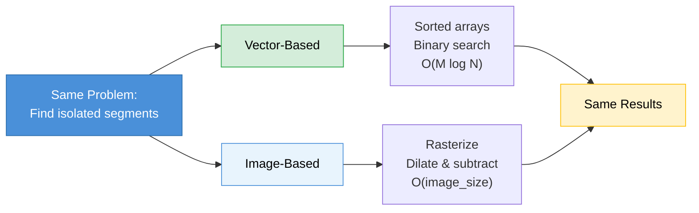

## A Simple Question, Twice

Imagine you have a massive dataset of line segments on a 2D plane — millions of them, all axis-aligned (horizontal or vertical). You need to answer one question for each segment:

> **Is this segment isolated?** That is, are there no other segments of the same orientation within a defined rectangular neighbourhood around it?

This sounds like a nearest-neighbour search. And it is — but the "nearest" part isn't Euclidean distance. It's a rectangular exclusion zone, and the answer is binary: isolated or not. What's interesting is that this exact same question can be solved with two completely different representations of the data, and each representation reveals different trade-offs that apply far beyond geometry.

---

## Approach 1: Vector-Based Search

### The Idea

Each line segment can be described as a small vector of numbers: its fixed coordinate (position), its span (start and end along the other axis), its direction, and its layer. This is structured, tabular data — essentially a table with columns like `[x, y_start, y_end, direction]`.

Once you think of segments as vectors in a coordinate space, the isolation question becomes a **range query**: "are there any other vectors whose `x` falls within `[my_x - margin, my_x + margin]` AND whose `y` span overlaps mine?"

### The Implementation

The classic trick for 1D range queries is **sorting + binary search**. Sort all same-direction segments by their fixed coordinate. For each candidate, use `searchsorted` (binary search) to find the slice of segments whose position falls within the exclusion window. Then check span overlap within that slice.

```python
# Conceptual sketch
sorted_positions = np.sort(edge_positions)
left = np.searchsorted(sorted_positions, candidate_x - margin)
right = np.searchsorted(sorted_positions, candidate_x + margin)
neighbours = sorted_positions[left:right]
# Check span overlap among neighbours...
```

This is **O(log N)** per candidate for the position filter, with a small linear scan for the span check. For M candidates and N total edges, the whole search is **O(M log N)**.

### Connection to Vector Search in General

This is the same pattern behind many well-known search systems:

- **kd-trees** split vector space along alternating axes to answer range queries and nearest-neighbour queries efficiently. Our sorted-array approach is essentially a 1D kd-tree.
- **R-trees** (used in PostGIS, spatial databases) group nearby bounding boxes hierarchically. If our exclusion zones were more complex, an R-tree would be the natural upgrade.
- **FAISS and vector databases** solve a higher-dimensional version of the same problem: given a query vector, find nearby vectors efficiently. They use techniques like IVF (inverted file indexes) that partition vector space into cells — conceptually similar to how we partition edges by position ranges.

The common principle: **represent each element as a point in some coordinate space, build an index that exploits the structure of that space, and prune the search by narrowing coordinates before checking detailed predicates.**

### When It Shines

- **Sparse data.** When most of the plane is empty, binary search skips vast ranges instantly. The work scales with *how many edges are actually nearby*, not the total size of the dataset.
- **Exact results.** There's no discretization or approximation. If an edge is 1 nanometre outside the exclusion zone, it's correctly excluded.
- **Extensible predicates.** Adding a new filter ("also check a secondary layer", "skip conjugate edges from the same rectangle") means adding an `if` statement inside the inner loop. The index structure doesn't change.

### Where It Struggles

- **Very dense data.** When edges are packed tightly, the binary search still finds a narrow position range, but the span-overlap check inside that range degrades toward linear. In the worst case (all edges at the same x-coordinate), you check everything.
- **Multiple exclusion rules.** Each rule (same-direction, opposite-direction, secondary layers) is a separate pass through the sorted array. The code grows linearly with the number of rules.

---

## Approach 2: Image-Based Search

### The Idea

Forget coordinates. Instead, **rasterize** the entire scene into a grid of pixels. Each segment becomes a set of lit pixels in a binary image. Now the isolation question becomes: "is this pixel far enough from other lit pixels?"

And "far enough" in image processing has a one-word answer: **dilation**. Dilate the obstruction image with a kernel shaped like the exclusion zone, and every lit pixel "grows" into its full exclusion footprint. Subtract the dilated mask from the candidate image. Whatever pixels survive are isolated.

### The Implementation

```python
# Conceptual sketch
candidate_img = rasterize(candidate_edges, resolution)
obstruction_img = rasterize(same_direction_edges, resolution)

kernel = np.ones((fov_height_px, fov_width_px))  # exclusion zone as a kernel
exclusion_mask = cv2.dilate(obstruction_img, kernel)

survivors = candidate_img & ~exclusion_mask
labels = cv2.connectedComponents(survivors)
# Extract cluster centres from labels...
```

Five operations. The spatial rule (the exclusion zone) is encoded entirely in the shape of the dilation kernel.

### Connection to Image Search in General

This is the same pattern behind a surprising number of search and detection systems:

- **Convolutional neural networks** slide learned kernels across images to detect features. Our dilation kernel is a hand-crafted "feature detector" that detects isolation.
- **Template matching** correlates a template image with a scene to find where it appears. Our approach is the inverse: correlating an exclusion template to find where things are *absent*.
- **Radar / signal detection** converts raw signals into spectrograms (images) and then applies morphological operations to find peaks that aren't obscured by noise. Same structure: discretize, convolve, threshold.
- **Approximate nearest-neighbour search** (like FAISS with LSH or product quantization) works by discretizing the vector space into buckets. Rasterization is the 2D spatial version of the same idea: trade exact coordinates for a grid, then do fast array operations on the grid.

The common principle: **convert your data into a dense, regular representation (pixels, buckets, bins), then use the regularity to replace per-element logic with bulk array operations.**

### When It Shines

- **Dense data.** Runtime is **O(image_size)** — it doesn't matter whether there are 1,000 or 10,000,000 edges. Dilation takes the same time regardless. For very dense layouts, this is faster than the vector approach.
- **Visual debugging.** The intermediate images *are* the debug output. You can literally look at the exclusion mask and see why a candidate was rejected. No need to trace through index lookups.
- **Parallelism-friendly.** Image operations are embarrassingly parallel. GPU acceleration (CUDA, OpenCL) is a drop-in upgrade.

### Where It Struggles

- **Resolution trade-off.** You must choose a pixel size. Too coarse and you lose precision — two edges 10 nm apart might land in the same pixel. Too fine and the image is enormous (memory and time scale quadratically with resolution).
- **Self-masking.** When you dilate the obstruction image, each edge masks *itself* — it falls inside its own exclusion zone. The fix is to zero out the centre of the dilation kernel, but getting the kernel geometry right for all four edge directions took more debugging than the rest of the method combined.
- **Discrete artifacts.** Edges that fall exactly on pixel boundaries behave differently from edges mid-pixel. The vector method has no such issue — coordinates are exact.

---

## The Real Lesson: Representation Is the Algorithm

These two approaches solve the *exact same problem* and produce the *same results*, but they share almost no code. The difference is entirely in **how the data is represented**:

| | Vector-based | Image-based |
|---|---|---|
| **Data representation** | Coordinate tuples (structured) | Pixel grid (dense) |
| **Index structure** | Sorted arrays / trees | The grid itself |
| **Query operation** | Binary search + predicate | Dilation + subtraction |
| **Runtime depends on** | Number of nearby elements | Image resolution |
| **Precision** | Exact | Limited by pixel size |
| **Adding new rules** | Add code (new predicates) | Add kernels (new dilations) |
| **Debug story** | Log coordinates, trace logic | View images, overlay masks |



This duality — **structured index search vs. dense field operations** — shows up everywhere in computer science:

- **Database queries** (B-tree index lookup vs. full table scan with bitmap filter)
- **Text search** (inverted index lookup vs. TF-IDF vector similarity)
- **Nearest-neighbour search** (kd-tree exact search vs. FAISS approximate search with quantization)
- **Collision detection** in games (spatial hash vs. rasterized occupancy grid)

In each case, the "vector" approach is precise and scales with data sparsity, while the "image" approach is approximate but scales with resolution and benefits from hardware parallelism.

---

## Final Thought

The search problem I described — "find isolated elements in a large geometric dataset" — is a niche application. But the engineering patterns are universal. Whether you're building a recommendation engine, a spatial database, a collision detection system, or an image feature detector, you'll face the same fundamental choice: **structure your data for precise, element-wise queries, or discretize it for fast, bulk operations.**

Understanding both paradigms — and knowing when each one wins — is one of the most transferable skills in algorithm design.
