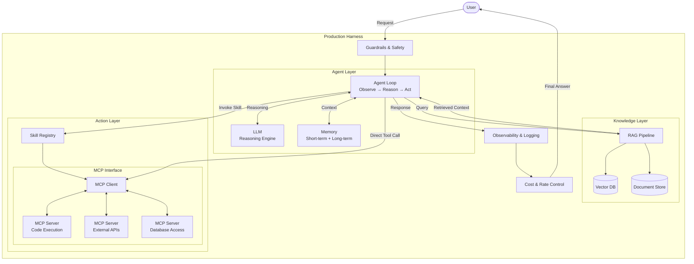

---

## 1. The Big Picture: From Answering Questions to Doing Work

Start with a simple question:

> **How does an LLM system go from answering questions to actually doing useful work?**

A raw LLM—GPT-4, Claude, Gemini, Llama—is a stateless function. You give it text, it gives you text back. It has no memory of previous conversations, no access to your company's documents, no ability to call an API, no way to read a file, and no mechanism to decide "I should search the web before answering this." It is, fundamentally, a very sophisticated autocomplete engine with a fixed knowledge cutoff.

This is not a limitation to be patched with clever prompting. It is an architectural boundary. To cross it, you need to build a *system* around the model. That system requires:

- **Memory** — so it can maintain context across turns and sessions
- **Knowledge (RAG)** — so it can access information beyond its training data
- **Tools / Actions** — so it can interact with the external world
- **Agent logic** — so it can decide *what* to do, not just *what to say*
- **Skills** — so complex capabilities can be packaged and reused
- **MCP (Model Context Protocol)** — so tool integrations can be standardized across providers
- **Harness / Production layer** — so the whole thing actually works reliably at scale

None of these components exist in isolation. They form a tightly coupled pipeline where each layer depends on and enables the others. The rest of this post explains how.

---

## 2. End-to-End Flow: Walking Through a Real Interaction

Consider this user request:

> *"I uploaded a photo of our server rack. Analyze it, cross-reference against our inventory database, and file a maintenance ticket for any hardware that looks like it needs replacement."*

This is a task no LLM can handle alone. Here is exactly what happens, step by step, in a well-designed system:

### Step 1 — Agent receives the request

The **Agent** (the orchestration layer, not the model itself) receives the user's input. The agent's job is to decompose this goal into a plan. It is a loop: observe → think → act → observe.

The agent immediately recognizes this requires multiple capabilities: image analysis, database lookup, and ticket creation. It begins planning.

### Step 2 — Memory provides context

Before the agent even calls the LLM, **Memory** is consulted.

- **Short-term memory** (conversation history): Was there a prior message in this session? Did the user mention which server rack or which data center? If so, that context is injected into the prompt.
- **Long-term memory** (persisted across sessions): Has the user filed similar tickets before? What format do they prefer? What priority level do they typically assign? This is retrieved and added as background context.

Memory does not answer the question. It *shapes* the question the LLM will see.

### Step 3 — Tool invocation: image analysis

The agent decides its first action: analyze the image. It invokes an **image analysis tool**—a vision model endpoint or a multimodal model's vision capability. The tool returns structured observations: "Rack unit 14: visible cable damage. Rack unit 22: amber fault LED active. Rack unit 31: dust accumulation on intake vents."

This is the **Action** layer. The LLM did not "see" the image in any meaningful sense—it delegated to a tool that could.

### Step 4 — RAG retrieves relevant knowledge

Now the agent has observations. But it needs to cross-reference against the inventory. The **RAG (Retrieval-Augmented Generation)** pipeline kicks in.

The agent takes the identified hardware (rack units 14, 22, 31) and queries a **vector database** containing the company's inventory records, warranty information, and maintenance history. The retriever returns:

- RU-14: Cisco Nexus 9300, installed 2023-01, warranty expired
- RU-22: Dell PowerEdge R750, installed 2024-06, under warranty, last serviced 2025-11
- RU-31: HPE ProLiant DL380, installed 2022-03, warranty expired, flagged in prior audit

This information was nowhere in the LLM's training data. RAG made it accessible.

### Step 5 — Skill execution: ticket filing

The agent now needs to file maintenance tickets. Rather than the agent manually constructing API calls for the ticketing system, it invokes a **Skill**—a pre-built, tested, multi-step capability: `file_maintenance_ticket`. The skill encapsulates:

1. Authenticate with the ticketing system
2. Format the ticket body according to the company template
3. Assign priority based on warranty status and severity
4. Attach the original image as evidence
5. Tag the responsible team

The agent calls this skill three times, once per hardware issue, with different parameters.

### Step 6 — MCP standardizes the tool interface

How does the agent actually *call* these tools—the image analyzer, the vector database, the ticketing system? In a fragmented world, each tool has its own bespoke API wrapper, its own authentication flow, its own response format. This is where **MCP (Model Context Protocol)** comes in.

MCP provides a standardized interface: a uniform way for the agent to discover available tools, understand their input/output schemas, and invoke them. The agent does not need custom code for each integration. It speaks MCP, and the tool servers translate.

```
Agent → MCP Client → MCP Server (image analyzer)
Agent → MCP Client → MCP Server (inventory vector DB)
Agent → MCP Client → MCP Server (ticketing system)
```

### Step 7 — Harness layer handles the production reality

While all this is happening, the **Harness / Production layer** is doing the invisible but critical work:

- **Rate limiting**: Ensuring the vector DB is not overwhelmed
- **Authentication**: Managing OAuth tokens for the ticketing system
- **Retry logic**: The image analysis call timed out on the first attempt; the harness retried
- **Logging and tracing**: Every step is recorded for debugging and audit
- **Cost tracking**: Three LLM calls, two RAG retrievals, three tool invocations—all metered
- **Guardrails**: The LLM's proposed ticket text is checked for PII leakage before submission
- **Latency monitoring**: The end-to-end response took 8.2 seconds; the harness logs which steps were the bottleneck

### Step 8 — Response assembly

The agent collects all results, passes them to the LLM for final synthesis, and returns:

> *"I analyzed the rack image and identified three issues. I've filed maintenance tickets for each:*
> - *Ticket #4821: RU-14 (Cisco Nexus 9300) — cable damage, warranty expired, priority HIGH*
> - *Ticket #4822: RU-22 (Dell PowerEdge R750) — fault LED active, under warranty, priority MEDIUM*
> - *Ticket #4823: RU-31 (HPE ProLiant DL380) — dust accumulation, warranty expired, priority LOW (flagged in prior audit)*
>
> *The rack image is attached to each ticket. Let me know if you want to adjust priorities."*

The user sees a clean answer. Behind it: memory, retrieval, tool calls, skill execution, protocol standardization, and production infrastructure all worked in concert.

---

## 3. Role of Each Component (In Context)

### Memory

**Role:** Provides temporal continuity. Without it, every interaction starts from zero.

**Connects to:** Agent (supplies context before each LLM call), RAG (long-term memory *is* a form of retrieval—sometimes over the user's own history), Harness (memory persistence, eviction policies, and storage are infrastructure concerns).

Two distinct types matter:

| Type | Scope | Storage | Example |
|------|-------|---------|---------|
| Short-term (working) | Single session | In-memory buffer | Current conversation turns |
| Long-term (episodic) | Cross-session | Database / vector store | User preferences, past decisions |

The architectural subtlety: short-term memory is usually just a sliding window of messages appended to the prompt. Long-term memory requires its own retrieval mechanism—which starts to look very much like RAG, except the corpus is the user's own interaction history rather than an external knowledge base.

### Knowledge / RAG

**Role:** Gives the LLM access to information it was never trained on, or information that changes frequently.

**Connects to:** Memory (long-term memory retrieval is structurally similar), Tools (the retriever itself is a tool the agent can invoke), Agent (decides *when* and *what* to retrieve), Harness (embedding pipelines, index updates, and chunk management are production workloads).

The RAG pipeline has its own internal architecture:

```
Query → Embedding Model → Vector Search → Top-K Chunks → Reranker → Context Injection → LLM
```

Critical engineering decisions live here: chunk size, overlap strategy, embedding model choice, hybrid search (vector + keyword), reranking models, and context window budgeting. These are not academic—they directly determine answer quality.

### Tools / Actions

**Role:** The LLM's hands. Without tools, the system can only generate text. With tools, it can read files, query databases, call APIs, execute code, send emails, and interact with any system that has an interface.

**Connects to:** Agent (decides which tools to call and in what order), Skills (a skill is a composed sequence of tool calls), MCP (standardizes how tools are discovered and invoked), Harness (tool execution needs sandboxing, timeouts, and error handling).

A tool is a single, atomic capability:

- `search_web(query) → results`
- `run_sql(query) → rows`
- `send_email(to, subject, body) → status`
- `analyze_image(image_url) → description`

The LLM does not execute tools. It *requests* tool execution by generating structured output (typically JSON with a function name and arguments). The runtime actually performs the call and returns results.

### Agent

**Role:** The decision-making loop. The agent is the orchestrator that turns a passive model into an active system.

**Connects to:** Everything. The agent is the central node. It reads memory, queries RAG, invokes tools, calls skills, and decides when to stop.

The core agent loop:

```
while not done:
    context = memory.get_relevant() + rag.retrieve(query)
    response = llm.generate(context + user_input)
    if response.has_tool_call:
        result = execute_tool(response.tool_call)
        memory.add(result)
    elif response.is_final_answer:
        done = True
        return response
```

This is a simplification, but it captures the essential pattern: observe, reason, act, repeat. The agent is not the LLM. The agent *uses* the LLM as its reasoning engine, but makes its own control flow decisions (often informed by the LLM's output).

### Skill

**Role:** A packaged, reusable, multi-step capability. If a tool is a single function, a skill is a workflow.

**Connects to:** Tools (skills compose multiple tools), Agent (invokes skills as higher-level actions), Harness (skills need versioning, testing, and access control).

Examples:

| Skill | Underlying Tools |
|-------|-----------------|
| `research_topic` | `search_web` → `read_page` → `summarize` → `format_report` |
| `deploy_service` | `run_tests` → `build_image` → `push_registry` → `update_k8s` |
| `file_maintenance_ticket` | `auth_ticketing` → `format_ticket` → `create_ticket` → `attach_file` |

Skills are the unit of capability scaling. When you want an agent to do something new, you build a skill, not rewrite the agent. This is analogous to installing a plugin.

### MCP (Model Context Protocol)

**Role:** Standardizes how agents discover, authenticate with, and invoke tools—regardless of who built the tool or which LLM is being used.

**Connects to:** Tools (MCP wraps tools in a uniform interface), Agent (the agent speaks MCP to access tools), Skills (skills are composed of MCP-accessible tools), Harness (MCP servers need to be deployed, monitored, and secured).

Before MCP, every tool integration was bespoke. If you wanted your agent to use Slack, you wrote a Slack adapter. If you wanted it to use Jira, you wrote a Jira adapter. Each had different auth, different schemas, different error handling.

MCP introduces a client-server architecture:

```
Agent (MCP Client) ←→ MCP Server (wraps any tool/service)
```

The MCP server exposes a standard interface: list available tools, describe their schemas, accept invocations, return results. The agent does not need to know *how* the tool works internally. It only needs to know *what* the tool does and *what inputs it expects*—both described in the MCP schema.

This is the USB-C of AI tool integration. It matters for the same reason USB-C matters: ecosystems scale when interfaces are standardized.

### Harness / Production Layer

**Role:** Everything that makes the system work reliably, safely, and economically in production. The harness is the difference between a demo and a product.

**Connects to:** Everything. Every component above runs *inside* the harness.

What the harness handles:

| Concern | What it does |
|---------|-------------|
| Orchestration | Manages the agent loop, parallel tool calls, timeouts |
| Guardrails | Content filtering, PII detection, output validation |
| Observability | Logging, tracing, latency metrics, token usage |
| Cost management | Token budgets, model routing (cheap model for easy tasks, expensive model for hard ones) |
| Reliability | Retries, fallbacks, circuit breakers |
| Security | Sandboxing tool execution, credential management, access control |
| Evaluation | Offline testing, A/B testing, regression detection |

The harness is not glamorous. It is what separates systems that work in a notebook from systems that work at 2 AM when the on-call engineer is asleep.

---

## 4. System Architecture



Key structural points:

- The **User** never interacts with the LLM directly. The Harness mediates everything.
- The **Agent** is the central orchestrator, but it sits *inside* the Harness, not above it.
- **RAG** and **Tools** are both resources the Agent accesses—retrieval is just another tool, conceptually.
- **MCP** is an interface layer, not a component. It standardizes access to tools, it does not replace them.
- The **Harness** wraps everything. Guardrails filter input, observability captures output, cost controls govern execution.

---

## 5. Why This Architecture Matters

### Why LLM alone is not enough

An LLM's knowledge is frozen at its training cutoff. It cannot access your database, read today's news, or execute code. It hallucinates when it does not know something, because it has no mechanism to say "I don't know—let me check." Every capability beyond text generation must be provided externally.

### Why RAG instead of just prompting

You cannot paste your entire knowledge base into a prompt. Context windows are finite (and even with million-token windows, retrieval quality degrades in the middle of long contexts—the "lost in the middle" problem). RAG fetches *only the relevant* information, keeping the context focused and the reasoning sharp. It also means the knowledge base can be updated without retraining the model.

### Why tools and actions are necessary

Text generation is not action. An LLM can *describe* how to query a database; it cannot *actually query* it. Tools bridge the gap between reasoning and execution. Without them, the system is a very articulate advisor that cannot do anything.

### Why agents are needed for decision-making

A single LLM call is stateless and linear: input → output. Real tasks are iterative and conditional. "If the search returns no results, try a different query. If the API returns an error, fall back to the cache. If the user's question is ambiguous, ask for clarification." This control flow logic is the agent. The LLM provides the reasoning; the agent provides the structure.

### Why MCP matters for scaling ecosystems

Without standardization, every tool integration is a custom connector. This does not scale. If there are 100 tools and 10 agent frameworks, you need 1,000 custom integrations. With MCP, you need 100 MCP servers and 10 MCP clients—110 total. This is the same network-effect argument that made HTTP, REST, and USB successful.

### Why the Harness layer is needed for real-world deployment

A demo can tolerate failures. A product cannot. The harness handles everything that goes wrong: retries when APIs fail, guardrails when the model generates harmful content, cost controls when a runaway agent loop burns through your API budget, logging when you need to debug why a user got a wrong answer at 3 AM last Tuesday. Production is where the engineering actually lives.

---

## 6. Concrete Example: Developer Assistant Resolving a Bug

Here is one scenario traced end to end.

**User input:**

> *"There's a bug where users are getting 500 errors on the /api/orders endpoint. Can you investigate and fix it?"*

**1. Memory check.**
The agent loads the conversation history. The user previously mentioned they are using FastAPI with PostgreSQL and deployed on Kubernetes. This context is added to the prompt without the user needing to repeat it.

**2. Agent plans.**
The LLM reasons: "I need to check the error logs, look at the relevant code, identify the bug, and propose a fix." It generates a plan with four steps.

**3. Tool call: log retrieval.**
The agent invokes `search_logs(service="orders-api", level="ERROR", last="1h")` via MCP. Returns: `IntegrityError: null value in column "user_id" violates not-null constraint`.

**4. RAG: code retrieval.**
The agent queries the codebase knowledge base (code indexed in a vector store) with the error message. RAG returns the relevant handler function in `orders/routes.py` and the SQLAlchemy model definition.

**5. Agent reasons.**
The LLM identifies the bug: a recent API change made `user_id` optional in the request schema but the database column is `NOT NULL`. The serializer silently passes `None`.

**6. Skill: apply code fix.**
The agent invokes the `edit_and_test` skill:
- Modifies the Pydantic model to make `user_id` required
- Runs the test suite via `run_tests(path="tests/test_orders.py")`
- Tests pass
- Creates a git commit with a descriptive message

**7. Tool call: create PR.**
The agent calls `create_pull_request(title="Fix: make user_id required in order creation", body="...")` via MCP.

**8. Harness throughout.**
Every LLM call is logged with token counts. The code execution is sandboxed. The git operations use scoped credentials. The total cost: $0.03 in API calls, 12 seconds wall time.

**9. Response to user:**

> *"Found it. The 500 errors are caused by `user_id` being optional in the request schema while the database column requires it. I've made `user_id` required in the Pydantic model, verified tests pass, and opened PR #347. Here's the diff: ..."*

Every component contributed. Remove any one, and the system either cannot do this at all or does it badly.

---

## 7. Engineering Perspective: How This Is Built

| System Component | Common Implementation | Role |
|-----------------|----------------------|------|
| Agent framework | LangChain, LlamaIndex, CrewAI, AutoGen, custom | Orchestrates the agent loop, manages state |
| LLM provider | OpenAI API, Anthropic API, vLLM (self-hosted), Ollama (local) | The reasoning engine |
| Vector database | Pinecone, Weaviate, Qdrant, Chroma, pgvector | Stores embeddings for RAG retrieval |
| Embedding model | OpenAI `text-embedding-3-large`, Cohere Embed, BGE, E5 | Converts text to vectors for similarity search |
| Tool execution | Python functions, REST APIs, gRPC services | Atomic capabilities the agent can invoke |
| MCP servers | Anthropic MCP SDK, community MCP servers | Standardized tool wrappers |
| Memory store | Redis (short-term), PostgreSQL (long-term), vector DB (semantic) | Persistence for conversation and user state |
| Serving layer | FastAPI, LitServe, vLLM serving | HTTP endpoints for the system |
| Guardrails | Guardrails AI, NeMo Guardrails, custom validators | Input/output safety filtering |
| Observability | LangSmith, Langfuse, Phoenix (Arize), OpenTelemetry | Tracing, debugging, evaluation |
| Deployment | Docker, Kubernetes, CI/CD pipelines | Packaging and scaling |

A typical production stack might look like:

```
FastAPI (serving) → LangChain (orchestration) → GPT-4 (reasoning)
                  → Qdrant (vector search) → MCP servers (tools)
                  → Redis (memory) → Langfuse (observability)
                  → Kubernetes (deployment)
```

The framework choice matters less than the architecture. LangChain, LlamaIndex, and custom solutions all implement the same fundamental pattern: agent loop + memory + retrieval + tool execution. The choice depends on your team's preferences, the complexity of your use case, and how much control you need.

---

## 8. Common Confusions

### Memory vs. RAG

Both involve "looking something up." The difference is *what* is being looked up and *why*.

| | Memory | RAG |
|---|--------|-----|
| **What** | The user's own interaction history, preferences, past decisions | External knowledge: documents, databases, codebases |
| **Why** | Continuity—"remember what we discussed" | Knowledge—"find information I was never trained on" |
| **When** | Every turn (short-term) or session start (long-term) | When the agent decides it needs external information |
| **Mechanism** | Often a buffer + optional vector retrieval | Always an embedding → search → rerank pipeline |

They can share infrastructure (both might use a vector database), but they serve different purposes.

### Tool vs. Skill

A **tool** is a single function: `search_web`, `run_sql`, `send_email`. It does one thing.

A **skill** is a composed workflow: `research_and_summarize` might call `search_web` five times, `read_page` three times, and `summarize` once, with conditional logic between steps.

Analogy: a tool is a hammer. A skill is "build a bookshelf"—which involves a hammer, a saw, a measuring tape, and a sequence of steps.

### Agent vs. LLM

The **LLM** is a function: `f(text) → text`. It has no memory, no tools, no loop.

The **Agent** is a program that *uses* the LLM as its reasoning engine, plus memory for state, tools for action, and a loop for iteration. The LLM is one component inside the agent, not the agent itself.

If the LLM is the engine, the agent is the car.

### MCP vs. LangChain

These solve different problems and are not competitors.

**LangChain** is an orchestration framework. It manages the agent loop, chains, memory, and prompt templates. It is *how you build* the agent.

**MCP** is an interface protocol. It standardizes *how tools are exposed and called*. It is a wire protocol for tool interoperability.

You can use LangChain *with* MCP. LangChain's agent calls tools via MCP instead of via bespoke Python function wrappers. They are complementary layers.

### Model vs. System

A **model** is a single neural network with weights. It takes input, produces output. GPT-4, Claude, Llama—these are models.

A **system** is everything around the model: the agent logic, the memory, the retrieval pipeline, the tools, the guardrails, the serving infrastructure. When people say "ChatGPT," they mean the *system* (which includes a model, plus memory, tools, guardrails, and a web interface). When people say "GPT-4," they mean the *model*.

The model is maybe 10% of the engineering effort in a production AI system. The other 90% is the system.

---

## 9. Summary

A production LLM system is not a model—it is an architecture. The **LLM** provides reasoning but lacks memory, knowledge, and the ability to act. **Memory** gives it continuity across turns and sessions. **RAG** gives it access to knowledge beyond its training data. **Tools** give it the ability to interact with the world. The **Agent** orchestrates all of these in a goal-directed loop, deciding what to retrieve, what to call, and when to stop. **Skills** package multi-step capabilities into reusable units that scale the agent's competence. **MCP** standardizes how tools are discovered and invoked, turning a fragmented integration landscape into a composable ecosystem. And the **Harness** wraps everything in the production infrastructure—guardrails, observability, cost controls, reliability—that separates a prototype from a product. Each component is necessary. None is sufficient alone. The system is the product.
